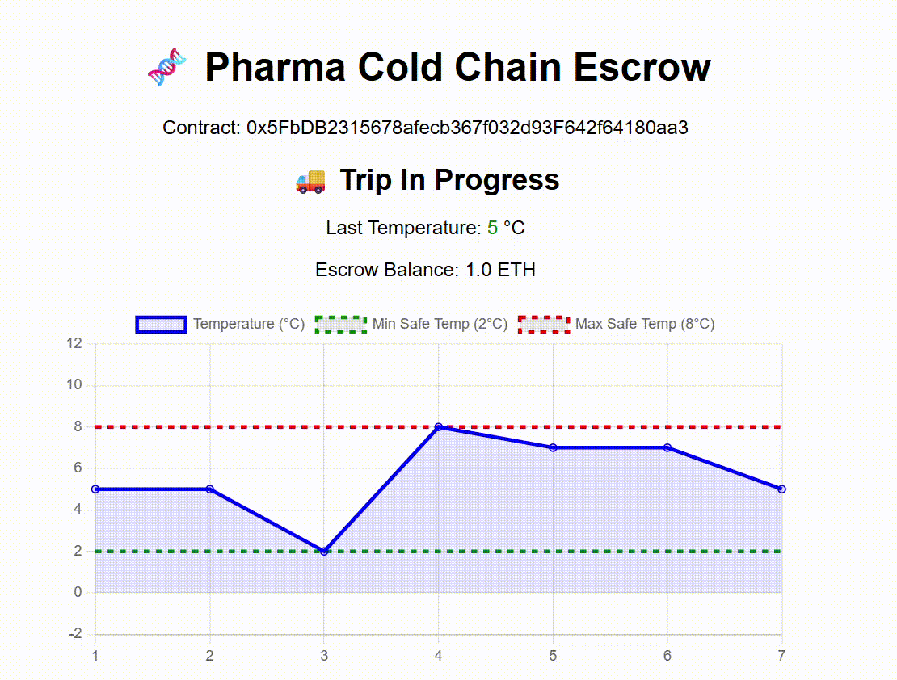

# Pharma Cold-Chain Micro-Escrow

A tiny proof-of-concept demonstrating **IoT‑triggered DeFi escrow** — bridging physical sensor data with blockchain smart contracts.  
Built to showcase my transition from **IoT & Data Engineering** into **Real‑World Asset (RWA) Tokenization** in banking.

## What it does
- A Python script simulates a temperature sensor for a pharmaceutical shipment.
- A Solidity smart contract on a local Ethereum network holds a 1 ETH payment in escrow.
- If the temperature remains within 2°C–8°C throughout the trip, the payment is released; otherwise, it's refunded to the buyer.
- A web dashboard displays the temperature feed, chart, and escrow status in real time.

## Why this matters for banking
Financial institutions are tokenizing real‑world assets (trade finance cargo, green bonds, commodities).  
**Trusting a digital token requires verifiable data from the physical world.** This project demonstrates the core pattern:

`IoT sensor → Oracle → Smart Contract → Automated Financial Action`

## Tech Stack
- **Blockchain:** Solidity, Hardhat (local node), ethers.js v5
- **IoT Simulator:** Python, web3.py
- **Frontend Dashboard:** HTML, JavaScript, Chart.js

## Quick Start
1. `npm install`
2. Start local blockchain: `npx hardhat node`
3. Deploy contract: `npx hardhat run scripts/deploy.js --network localhost`
4. Copy the deployed address into `scripts/simulate-iot.py` and `frontend/index.html`
5. Install Python deps: `pip install web3`
6. Run simulator: `python scripts/simulate-iot.py`
7. Open `frontend/index.html` in your browser

## Project Structure
pharma-escrow-demo/
├── contracts/
│ └── ColdChainEscrow.sol # The escrow smart contract
├── scripts/
│ ├── deploy.js # Deployment script
│ └── simulate-iot.py # IoT temperature simulator (oracle)
├── frontend/
│ └── index.html # Live dashboard
├── hardhat.config.js
├── package.json
└── README.md

## Future Enhancements
- Replace direct oracle call with a decentralized oracle network (Chainlink)
- Add multi-sensor attestation
- Deploy to a public testnet (Sepolia)
- Integrate NFC/GPS data for physical asset tracking

## Author
**Aminurhakim** — IoT & Data Engineer transitioning into Digital Assets / RWA Tokenization
